# English Mastery - 12 Design Variants

A comprehensive collection of 12 modern landing page designs for an English Course website. Built with vanilla HTML/CSS, Tailwind CDN, and Google Fonts.

---

### 🇮🇩 Deskripsi (Bahasa Indonesia)
Proyek ini berisi 12 varian desain landing page untuk kursus bahasa Inggris.

**Daftar Desain:**
1. Neo-Brutalist
2. Notion
3. Stripe
4. Linear
5. Vercel
6. Apple
7. Claude
8. Supabase
9. Webflow
10. Modern
11. Mintlify
12. Framer

---

### 📸 Screenshots Catalog

| Variant | Screenshot |
|---------|------------|
| Neo-Brutalist | 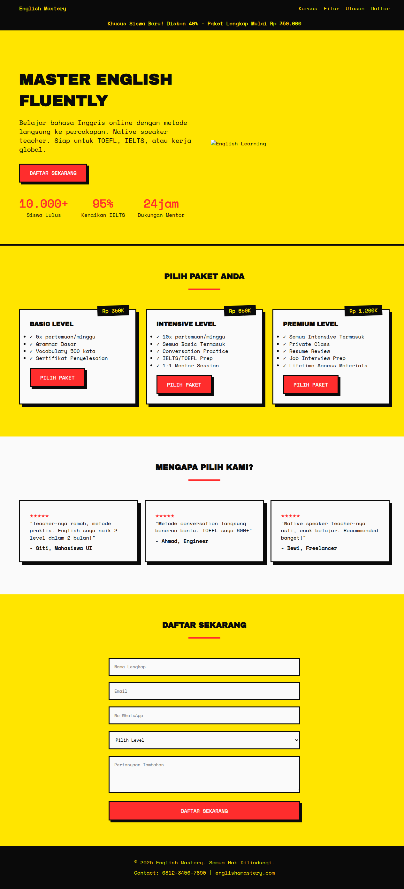 |
| Notion | 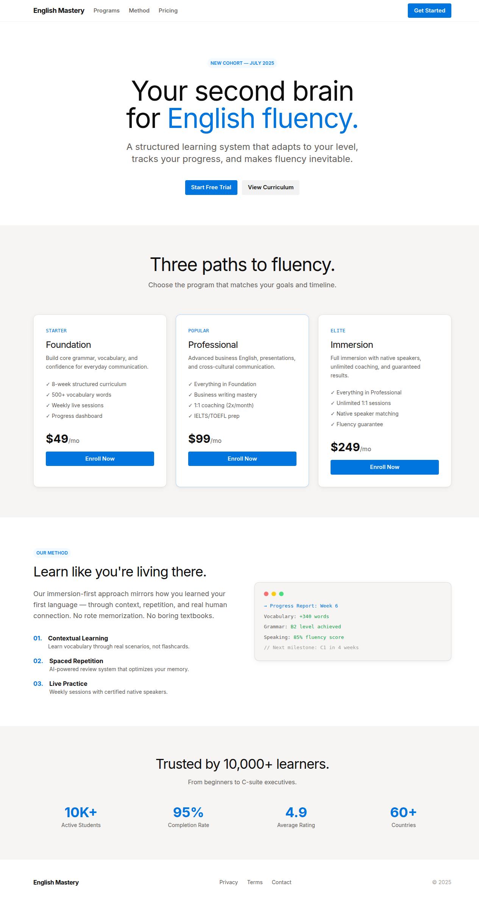 |
| Stripe | 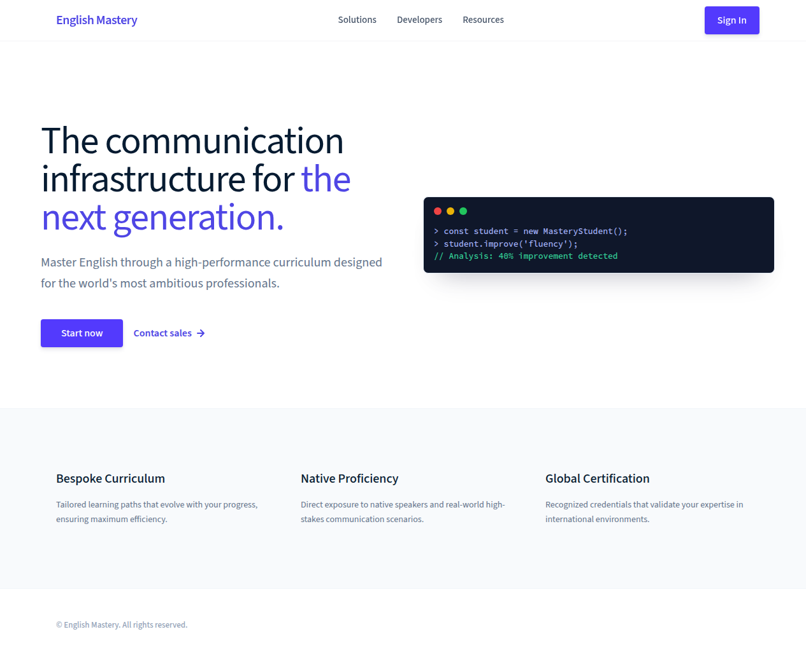 |
| Linear | 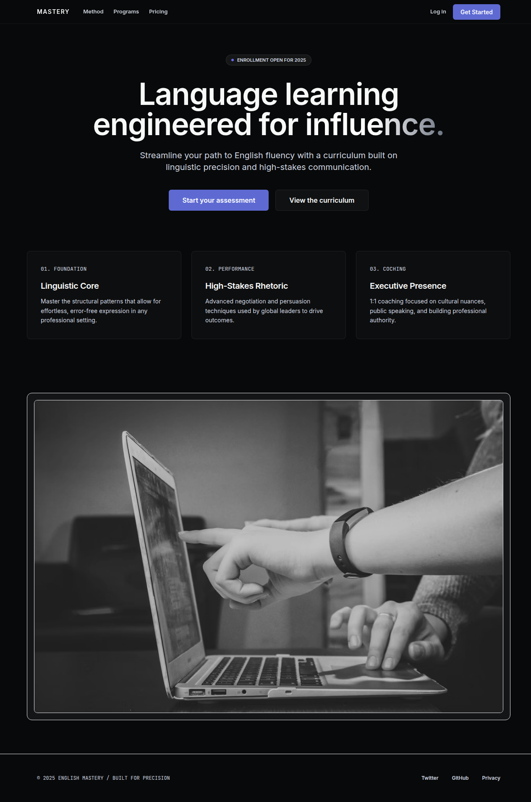 |
| Vercel | 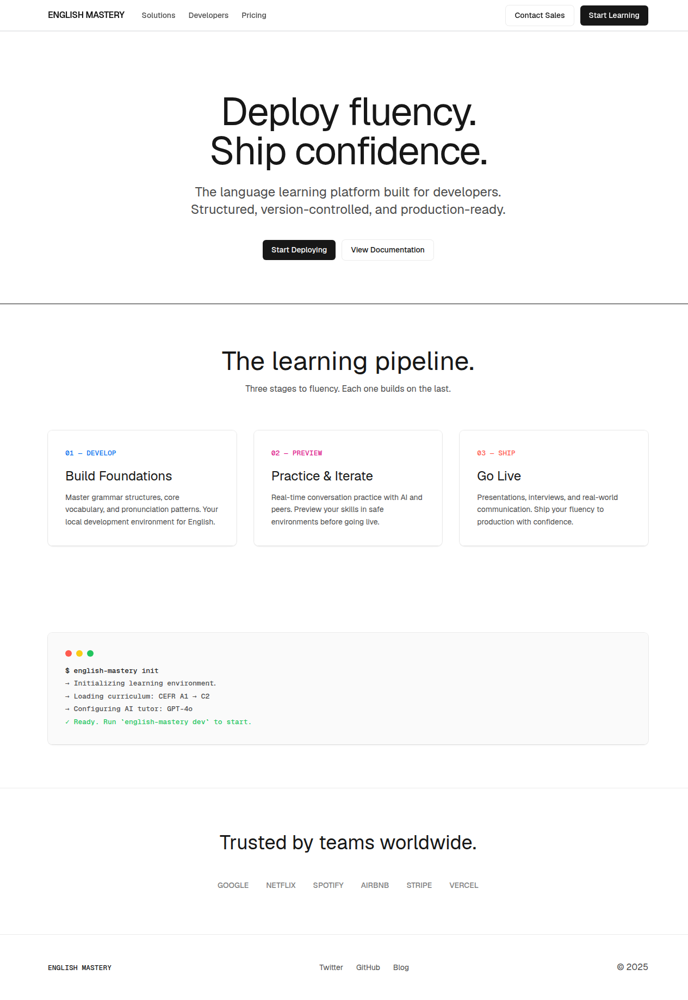 |
| Apple | 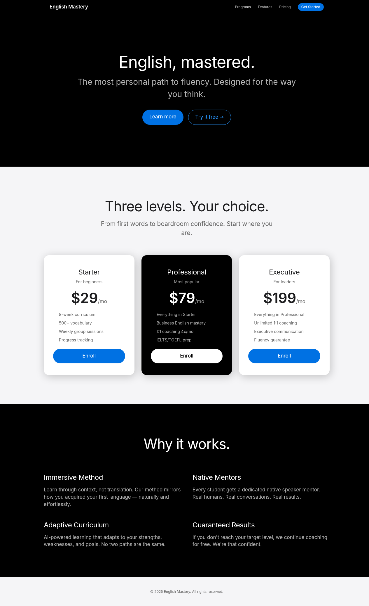 |
| Claude | 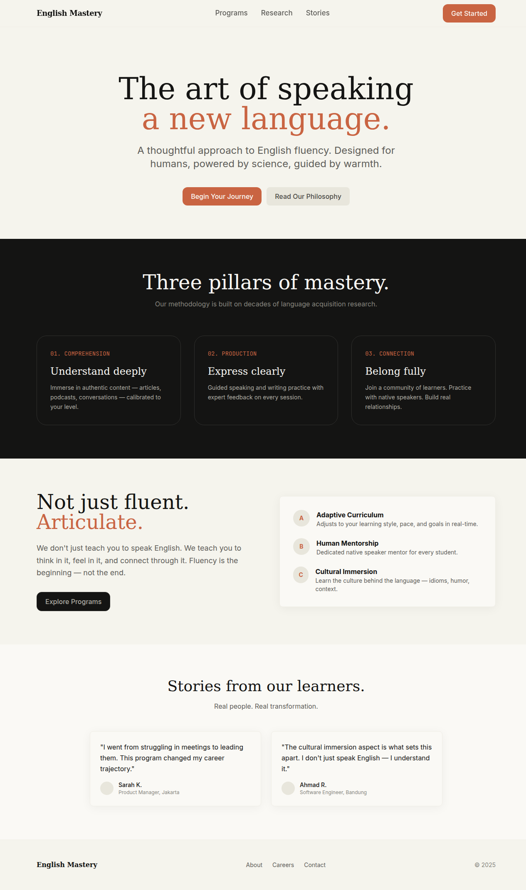 |
| Supabase | 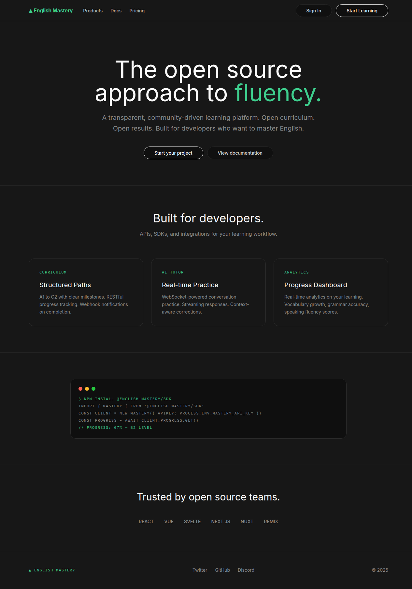 |
| Webflow | 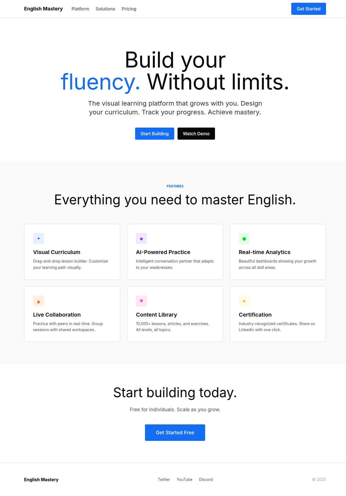 |
| Modern | 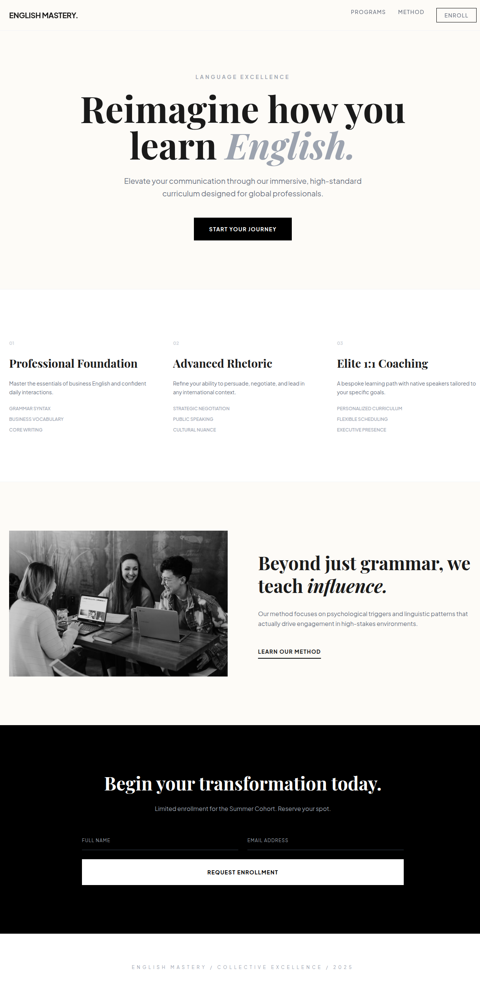 |
| Mintlify | 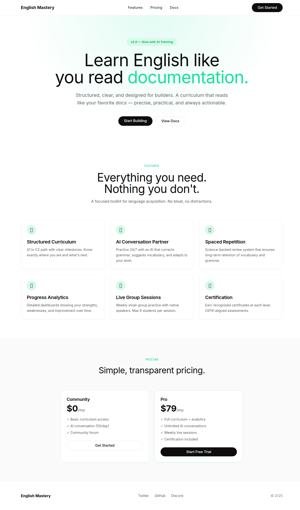 |
| Framer | 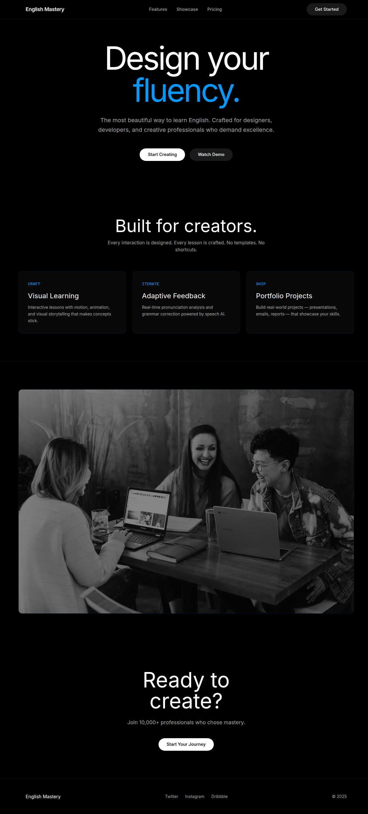 |

---

Developed by **Ihsan Bagus** & **Hermes Agent**.
